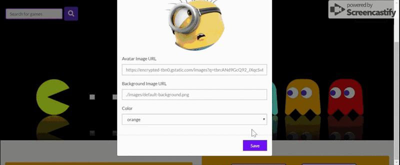
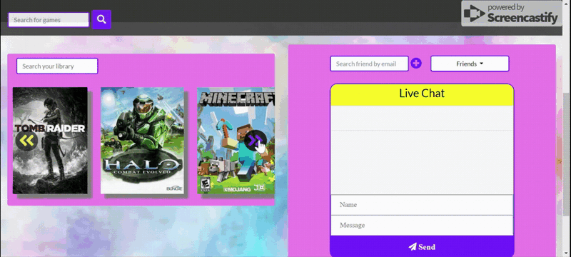

# iGame 🎮

iGame is a full-stack application that lets gamers create a personal account and add their favorite video games to their library. Gamers can also add their friends and connect through a live chat.

## How It Works

Create your account, add games, and personalize your page with your own avatar and background colors


Add your friends by email. They will be listed under the "Friends" dropdown menu as "Pending" until they accept or deny your friend request.



Accepting friend requests means you also have access to their games and can add them to your library. Enjoy chatting with them about your progress in the Live Chat!



## Demo

iGame is hosted on Heroku. Check it out by [clicking here](https://igame-30391.herokuapp.com/).

## Getting Started

To use iGame locally, navigate to http://localhost:3000 after completing the following steps:

```js

git clone git@github.com:MonkeyInitiatives/iGame.git
cd igame
npm install
node server.js

```

## Technologies Used

* Handlebars
* CSS/Bootstrap
* JavaScript
* jQuery
* MySQL
* Node.js
* AJAX
* Express
* Passport.js
* IGDB API
* Socket.io

## Authors

- Thomas Woods: [LinkedIn](https://www.linkedin.com/in/tom-w-352581173/) | [GitHub](https://github.com/MonkeyInitiatives)
- Fernanda Marroquin: [LinkedIn](https://www.linkedin.com/in/fernandamarroquin/) | [GitHub](https://github.com/fernandamarr)
- Alexander Feldman: [LinkedIn](https://www.linkedin.com/in/alexander-feldmanx1/) | [GitHub](https://github.com/afeldmanx1)